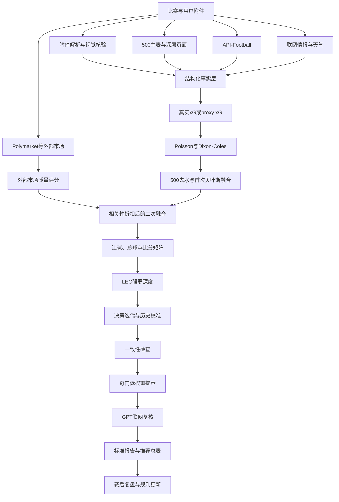

# 足球赛前分析系统项目介绍书

版本：2026-06-23  
项目仓库：`football-analyst-skill`  
适用范围：中国竞彩、世界杯及主要足球赛事的赛前概率分析  

> 本项目用于数据研究、模型校准和赛后复盘。输出是基于当前数据截点的概率估计，不是结果保证。

## 一、项目定位

本项目是一套以500彩票网竞彩数据为主入口、以数学概率模型为核心、以多源情报和市场交叉验证为补充的足球赛前分析系统。

系统不追求用某一个数据源直接给出结论，而是解决四个更具体的问题：

1. 一支球队的胜面有多大。
2. 胜面是否足以支持当前让球深度。
3. 比赛更可能落在哪个总进球区间。
4. 哪些比分属于概率主线，哪些比分必须作为风险上沿或冷门保护。

项目的核心原则是：**赛果、让球、总球和比分必须分别建模，强队胜面不能直接等同于赢深。**

## 二、系统目标

- 建立可重复执行的标准赛前分析流程。
- 将附件、网页、API、天气和赛事情报统一成结构化输入。
- 对原始市场数字去水，避免把返还率差异误认为真实概率。
- 使用Poisson/Dixon-Coles、历史先验和proxy xG生成独立模型概率。
- 用贝叶斯方法融合模型与不同市场证据。
- 将积分形势、阵容、天气和战术风险转化为可审计的小幅修正。
- 同时输出赛果、让球三向、总球和比分分布。
- 保存数据截点、来源、触发规则和融合前后概率，便于赛后复盘。

## 三、总体架构



## 四、数据源体系

### 4.1 主数据源

| 数据源 | 主要内容 | 系统角色 |
|---|---|---|
| 500竞彩主表 | 胜平负、让球胜平负、比分、总进球、半全场 | 官方竞彩市场主入口 |
| 500深层页面 | 欧赔、亚洲盘、大小盘、排名、近况、交锋、赛程、预计阵容 | 市场变化和基本面主源 |
| 用户附件 | PDF、XLS、XLSX、CSV、DOCX | 用户指定数据批次和审计依据 |
| API-Football | fixture、standings、injuries、lineups、statistics、odds | 赛程、场地、积分和阵容补源 |
| Open-Meteo | 开球时段温度、湿度、降雨、风速 | 比赛节奏和场地环境修正 |
| 权威媒体及官方渠道 | 伤停、发布会、轮换、战意 | 联网事实核验 |
| Opta Analyst | 模拟概率、xG和比赛事实 | 有新鲜赛前模拟时进入赛果多源融合 |
| Polymarket | 活跃胜平负合约、价格、成交量、流动性和价差 | 第二市场证据 |

### 4.2 数据可信度原则

数据按“确认事实、可信报道、预计信息、未知”分级：

- 正式首发高于预计首发。
- 官方伤停高于媒体推测。
- API返回0行表示“没有返回数据”，不表示“确认无人缺席”。
- 真实xG优先；没有真实xG时必须明确标注`proxy xG`。
- 附件必须实际解析；PDF还需逐页渲染核验关键表格。
- 市场价格必须去水或归一化，不能直接当最终概率。

## 五、标准分析流程

### 第1步：任务识别

- 确认比赛、赛事、时间、主客顺序和竞彩让球。
- 判断赛事阶段：联赛、杯赛、世界杯小组轮次或淘汰赛。
- 建立数据截点，避免混入赛后信息。

### 第2步：附件解析

- 检查文件真实格式，而不是只相信扩展名。
- 解析PDF、XLS/XLSX、CSV和DOCX。
- 对PDF关键页做视觉核验。
- 输出`source_extract_summary.json`记录成功、失败和限制。

### 第3步：获取500完整市场

- 主表：普通三向、让球三向、比分、总进球、半全场。
- 深层市场：欧赔、亚洲盘、大小盘和初盘至即时变化。
- 基本面：FIFA或联赛排名、近10场、交锋、赛程和预计阵容。
- 普通三向未开售时，使用百家均值替代并降低市场证据强度。

### 第4步：API与联网复核

- API-Football匹配准确fixture和场地。
- 读取积分、首轮赛果、伤停、首发和技术统计。
- 联网检查官方消息、权威媒体、天气和轮换。
- 每个空端点和失败请求都必须写进审计。

### 第5步：独立进球模型

- 优先读取真实赛前xG/xGA。
- 缺失时调用`core/xg_proxy_model.py`。
- proxy xG综合近期进失球、样本可靠度、市场总球、实力排名、天气和伤停。
- 国家队小样本向基准值收缩，避免一两场比分造成极端外推。

### 第6步：Poisson与Dixon-Coles

- 根据双方预期进球生成完整比分矩阵。
- 计算胜、平、负概率。
- 计算精确总进球分布。
- 使用Dixon-Coles低比分相关修正，改善0-0、1-0、0-1和1-1附近的估计。

### 第7步：市场去水

`core/market_dewater.py`将原始十进制市场数字转换为：

```text
原始隐含概率 = 1 / 市场数字
去水概率 = 原始隐含概率 / 三项隐含概率之和
水位总和 = 三项隐含概率之和 - 1
```

普通三向、让球三向和精确总进球分别去水，不互相替代。

### 第8步：贝叶斯融合

`core/bayesian_fusion.py`把模型概率视作Dirichlet先验，把去水后的市场概率视作证据：

```text
后验概率 =
(模型概率 × 先验强度 + 市场概率 × 证据强度)
/ (先验强度 + 证据强度)
```

若模型与市场最大偏差达到14个百分点，市场证据强度乘`0.88`；达到22个百分点，乘`0.75`。

### 第9步：比分与总球约束

- 比分市场以指数`0.18`进行温和校正，不直接覆盖Poisson矩阵。
- 使用迭代比例拟合，使比分矩阵同时符合最终赛果分布和总球分布。
- Top1和Top2保留概率主线。
- 强弱差明显时，Top3至Top5必须保留3-0、3-1、4-0、4-1等上沿路径。
- 冷门栏同时保留低比分冷门和高波动冷门。

### 第10步：LEG强弱深度

LEG不重新预测胜平负，而是回答“热门方只有胜面，还是具备赢深条件”。

- L：Line，市场与让球深度。
- E：Expected Goals，真实或proxy xG创造力。
- G：Game Context，战意、天气、阵容和波动。

### 第11步：决策迭代

`core/decision_iteration.py`读取`data/calibration/decision_iteration_rules.json`，根据历史复盘规则小幅修正：

- 强队胜面高但让球深度不足。
- 首轮谨慎或第二轮净胜球需求。
- 天气压低节奏。
- 弱队定位球、反击或低位韧性。
- 强队轮换、伤停和后段崩盘路径。
- 受让`+1`保护与客队赢深风险。

规则修正必须输出“调整前、调整后、触发规则”。

### 第12步：一致性检查

`core/model_consistency.py`检查：

- 赛果推荐是否与让球结算冲突。
- 总球方向是否支持Top比分。
- LEG深度是否与让球推荐一致。
- 保守比分是否集中在让球卡线位置。
- 决策迭代是否制造新的逻辑冲突。

冲突不被隐藏，而是转化为降级、双防或回避单挑。

### 第13步：辅助复核

- 奇门只生成低权重冲突提示。
- GPT负责联网核验、发现遗漏和检查叙事一致性。
- Opta在模拟时间、对阵和赛前状态可核验时进入赛果多源融合。
- GPT和奇门不能直接覆盖数学概率。

### 第14步：报告输出与复盘

- 输出完整报告、推荐总表和结构化JSON。
- 保存市场、API、天气和外部市场快照。
- 赛后记录Brier Score、Log Loss、玩法表现和错误归因。
- 只有经过多场复盘验证的经验，才进入校准规则库。

## 六、权重体系总览

项目不存在一张适用于所有层的固定100%权重表。原因是赛果、让球、总球和比分是不同问题，必须分别融合。

### 6.1 通用工作流组件基准

`core/probability_fusion.py`的默认组件权重为：

| 组件 | 基准权重 | 作用 |
|---|---:|---|
| 当前基础模型 | 55% | 当前阵容、状态、xG和比赛语境 |
| 去水市场模型 | 25% | 市场集体信息校准 |
| 历史国家队模型 | 20% | Elo、历史攻防和赛事经验先验 |

缺失某一组件时，其权重回流当前基础模型。该表是通用工作流基准，不等同于每场严格报告的最终有效权重。

### 6.2 严格赛果模型的动态权重

当前严格世界杯分析先构造进球均值，再把Poisson、500、Opta和Polymarket一次性融合，避免顺序依赖：

#### 进球均值层

```text
独立预期进球 = proxy xG × Wproxy + 历史模型 × (1-Wproxy)
最终预期进球 = 独立预期进球 + 比赛语境修正
```

`Wproxy`不是全局常数。当前四场使用`0.64-0.70`，即当前proxy信息约64%-70%，离线历史先验约30%-36%。数据越新、越完整，proxy权重越高；数据越稀疏，历史先验承担更多稳定作用。

#### 一次性赛果融合层

| 场景 | Poisson | 500 | Opta | Polymarket |
|---|---:|---:|---:|---:|
| 官方普通三向可用 | 45% | 30% | 15% | 10% |
| 普通三向未开售，以百家均值替代 | 50% | 20% | 18% | 12% |

以上是基础权重。每个来源还要乘质量、相关性和偏差折扣，最后重新归一化。500与Poisson偏差超过14个百分点时乘`0.88`，超过22个百分点时乘`0.75`。Opta当前按新鲜的25,000次赛前模拟进入；过期或阵容状态不明时应降低质量系数。

### 6.3 Polymarket权重

Polymarket作为第二市场证据，不能与500简单相加。两者都反映公开信息，存在明显相关性，直接同权会重复计票。

质量权重计算为：

```text
流动性得分 = min(1, log10(流动性+1) / 6.5)
成交量得分 = min(1, log10(成交量+1) / 6.5)
价差得分   = clamp(1 - 平均买卖价差 / 0.05)

质量系数Q =
(流动性得分×50% + 成交量得分×30% + 价差得分×20%)

Polymarket原始贡献 = 基础权重 × Q × 0.75相关性折扣 × 偏差折扣
```

当前四场的实际权重：

| 场次 | Poisson | 500 | Opta | Polymarket |
|---|---:|---:|---:|---:|
| 周二045 | 53.6% | 18.9% | 19.3% | 8.2% |
| 周二046 | 51.8% | 20.7% | 18.6% | 8.9% |
| 周二047 | 46.3% | 30.9% | 15.4% | 7.3% |
| 周二048 | 46.4% | 30.9% | 15.5% | 7.2% |

Polymarket只校准赛果三向。因为当前没有精确比分合约，它不会直接修改某个比分；赛果后验变化会通过比分矩阵约束间接传导到比分概率。

### 6.4 让球层权重

让球三向单独建模：

| 组件 | 强度 |
|---|---:|
| 比分矩阵导出的让球结算先验 | 11 |
| 500官方让球三向去水证据 | 10 |

无偏差折扣时，市场证据占比约47.6%。让球层不使用普通胜平负概率替代，因此可能出现“主胜很高，但让负仍为最高项”的合理结果。

### 6.5 总进球层权重

| 组件 | 强度 |
|---|---:|
| Poisson精确总球先验 | 12 |
| 500精确总进球去水证据 | 9 |

无偏差折扣时，市场证据占比约42.9%。随后天气、比赛阶段和历史规则可对总球桶做有限迁移。

### 6.6 比分市场权重

比分市场不是按固定18%线性混合，而是采用指数`0.18`做收缩校正：

```text
校正后比分权重 = 原模型比分权重 ×
(市场条件概率 / 模型条件概率) ^ 0.18
```

这意味着比分市场只温和改变相对排序，不会因为某个低价比分就彻底覆盖Poisson结构。

### 6.7 LEG内部权重

LEG总分：

| 维度 | 权重 |
|---|---:|
| L 市场深度 | 38% |
| E 预期进球与创造力 | 34% |
| G 比赛语境 | 28% |

双方深度分：

| 维度 | 权重 |
|---|---:|
| 市场方向分 | 35% |
| xG能力分 | 35% |
| 比赛语境分 | 30% |

LEG是解释和深度验证层，不直接替代胜平负后验。

### 6.8 决策迭代的修正边界

| 项目 | 最大变动 |
|---|---:|
| 单一赛果概率 | 8个百分点 |
| 单一总球桶 | 10个百分点 |
| 比分Top1/Top2 | 原始保守位优先保留 |

多数实际规则每次只移动`0.5-3.5`个百分点。多条规则同时触发时仍受总边界约束。

### 6.9 零直接权重层

以下模块默认没有独立概率权重：

| 模块 | 直接概率权重 | 正确用途 |
|---|---:|---|
| 奇门辅助 | 0% | 冲突时触发约0.5个百分点的低权重风险提示 |
| GPT联网复核 | 0% | 核验事实、发现遗漏、要求重算 |
| 人工文字判断 | 0% | 解释模型，不覆盖模型 |

若这些模块发现新的可验证事实，应先回写数据层，再重新运行模型，而不是直接改最终概率。

## 七、权重设计原则

### 7.1 为什么市场不能无限加权

- 500、Polymarket和欧洲市场往往共享相同公开信息。
- 多个市场同时看好一方，不代表获得了多个完全独立证据。
- 相关市场必须折扣，否则热门方向会被重复放大。

### 7.2 为什么历史模型不能主导

- 国家队阵容和教练变化快。
- 历史大样本稳定，但可能无法反映当前伤停和赛制。
- 历史模型适合提供基准，不适合替代当前比赛信息。

### 7.3 为什么情报没有固定百分比

- “主力前锋缺阵”和“预计可能轮换”可信度不同。
- 天气只有在达到高温、强风、降雨或高湿阈值时才应改变节奏。
- 情报先改变xG、战意标签或规则条件，再传导到概率。

### 7.4 为什么赛果与让球必须拆开

热门方可以高概率获胜，但大量胜局可能只是一球或两球。让球层依赖胜差分布，而不是只依赖胜率。

## 八、当前四场融合示例

采用一次性多源融合后的结果如下：

| 场次 | 多源后验 | 实际权重 P/500/O/PM | 决策迭代后最终概率 |
|---|---|---|---|
| 周二045 葡萄牙vs乌兹别克 | 75.0 / 16.2 / 8.8 | 53.6/18.9/19.3/8.2 | **74.5 / 16.5 / 9.0** |
| 周二046 英格兰vs加纳 | 78.4 / 15.2 / 6.4 | 51.8/20.7/18.6/8.9 | **76.9 / 16.7 / 6.4** |
| 周二047 巴拿马vs克罗地亚 | 16.3 / 22.7 / 61.1 | 46.3/30.9/15.4/7.3 | **16.3 / 22.7 / 61.0** |
| 周二048 哥伦比亚vs刚果(金) | 58.8 / 25.6 / 15.6 | 46.4/30.9/15.5/7.2 | **58.3 / 25.9 / 15.8** |

P/500/O/PM分别表示Poisson、500、Opta和Polymarket。最后一列还包含天气、深度、比分结构和决策迭代影响。

## 九、主要输出文件

每批正式分析建议保存：

```text
source_extract_summary.json       # 附件解析审计
market/latest_market.json         # 500最新市场
api/api_audit.json                # API端点状态
weather/weather_audit.json        # 开球时段天气
online_review_sources.json        # 联网复核来源
polymarket_snapshot.json          # Polymarket原始快照
model_analysis.json               # 全部模型中间量和最终概率
*_严格分析与GPT联网复核报告.md      # 完整报告
*_推荐总表.md                       # 汇总表
```

## 十、核心代码目录

| 文件 | 职责 |
|---|---|
| `PROJECT_IRON_RULES.md` | 正式分析不可跳过的流程规则 |
| `CURRENT_CONTEXT.md` | 当前任务的短上下文 |
| `core/market_dewater.py` | 市场去水 |
| `core/bayesian_fusion.py` | 贝叶斯分类概率融合 |
| `core/probability_fusion.py` | 通用模型、市场和历史组件融合 |
| `core/multi_source_fusion.py` | 顺序无关的多源赛果融合与权重审计 |
| `core/xg_proxy_model.py` | 真实xG缺失时的proxy xG |
| `core/math_models.py` | Poisson、Dixon-Coles和比分矩阵 |
| `core/leg_model.py` | L/E/G强弱深度验证 |
| `core/decision_iteration.py` | 历史复盘规则微调 |
| `core/model_consistency.py` | 跨玩法一致性检查 |
| `core/qimen_assistant.py` | 低权重奇门辅助 |
| `core/llm_analyzer.py` | GPT联网复核 |
| `data/calibration/decision_iteration_rules.json` | 可审计校准规则库 |
| `data/calibration/multi_source_weight_policy.json` | Poisson、500、Opta、Polymarket统一权重配置 |

## 十一、质量控制与铁律

正式报告必须满足：

1. 用户附件全部实际解析。
2. 500主表与深层页面完整读取。
3. API空结果和联网失败如实披露。
4. 普通三向、让球三向和总球分别去水。
5. 真实xG与proxy xG明确区分。
6. 输出模型与市场偏差及可信度。
7. 输出LEG、决策迭代和一致性检查。
8. 奇门和GPT不能覆盖数学模型。
9. 比分Top必须同时覆盖保守主线和合理上沿。
10. 输出前完成步骤审计和风险表达检查。

## 十二、已知限制

- 500页面结构变化可能造成解析字段缺失。
- API免费权限可能不返回伤停、首发或技术统计。
- 国际赛真实赛前xG通常不足，proxy xG仍有估算误差。
- 市场之间存在相关性，无法视为完全独立样本。
- 正式首发公布后，赛前版本可能需要重新计算。
- 小样本赛事和高轮换比赛的比分尾部不确定性较高。
- 当前奇门模块是轻量辅助，不是完整传统排盘引擎。

## 十三、迭代方向

### 近期

- 根据发布时间和阵容变化自动计算Opta新鲜度系数。
- 自动监控临场价格、流动性和盘口跨档。
- 增加正式首发发布后的自动重算。
- 为每场输出统一的数据完整度评分。

### 中期

- 使用赛后Brier Score和Log Loss重新标定各数据源权重。
- 按赛事、轮次和市场类型学习动态权重。
- 引入比分概率校准曲线，检查Top比分长期偏差。
- 建立外部市场间的相关性矩阵，替代当前固定0.75折扣。

### 长期

- 将数据抓取、特征工程、概率融合和报告生成拆成稳定流水线。
- 建立可回放的历史赛前快照库。
- 用时间滚动验证确定权重，而不是依赖单批比赛经验。
- 对不同赛事分别训练赛果、让球和总球校准器。

## 十四、使用建议

- 新会话只读取`PROJECT_IRON_RULES.md`和`CURRENT_CONTEXT.md`，避免历史报告占用上下文。
- 需要历史对比时，再按日期读取对应`data/`目录。
- 市场或首发发生明显变化时重新执行完整模型，不只改文字结论。
- 修改权重前先保存旧版本和赛后评分，确保调整可回测、可撤销。

## 十五、结语

本项目的价值不在于给出一个看似确定的比分，而在于把赛前判断拆成一条可核验的证据链：

```text
事实数据 → 独立模型 → 市场去水 → 多源融合 → 深度验证
→ 历史校准 → 一致性检查 → 风险表达 → 赛后复盘
```

任何新增数据源都必须先回答三个问题：它提供了什么独立信息、与现有数据相关性多高、其影响能否被赛后验证。只有满足这三点，才应进入正式概率模型。
