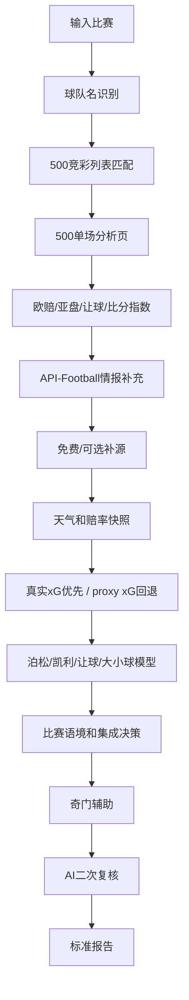

# Football Analyst Skill

面向中国竞彩场景的足球赛前分析项目。项目以 500彩票网为主数据源，结合 API-Football、联网搜索、天气、赔率历史、泊松模型、凯利公式、让球/大小球独立模型、奇门遁甲辅助和 AI 二次复核，生成单场报告、多场汇总与串关风控建议。

本项目仅用于学习、研究和模型复盘，不构成投注建议。

## 功能概览

- 抓取中国竞彩比赛、让球、胜平负、让球胜平负。
- 从 500 混合过关页抓取官方竞彩比分、总进球数和半全场赔率。
- 抓取 500 单场分析页：FIFA 排名、近况、交锋、主客场拆分、未来赛程、预计首发、伤停/停赛、澳门心水。
- 抓取 500 深层赔率：百家欧赔、亚盘、让球指数、比分指数。
- 使用 API-Football 补充赛程、排名、伤停、首发和技术统计。
- 使用 Open-Meteo 获取天气和比赛地时区信息。
- 使用 Odds-API.io、The Odds API、TheSportsDB、ClubElo、football-data.co.uk 做可选补源。
- 记录赔率快照，用于临场变化和收盘线观察。
- 计算泊松胜平负、比分、大小球概率。
- 计算凯利值、EV、资金建议和风险过滤。
- 独立判断让球穿盘、大小球和比赛语境。
- 生成奇门遁甲辅助局像、胜平负和比分方向。
- 支持本机 Codex CLI 自动做 AI 二次复核，或生成 Agent Prompt。
- 支持赛后复盘、命中率、ROI 和错误归因统计。

## 快速开始

```bash
git clone https://github.com/YOUR_USERNAME/football-analyst-skill.git
cd football-analyst-skill
python3 -m venv .venv
source .venv/bin/activate
python3 -m pip install -r requirements.txt
```

单场分析：

```bash
python3 new_main.py --match "丹麦 vs 刚果(金)"
```

多场分析：

```bash
python3 new_main.py --matches "丹麦 vs 刚果(金),荷兰 vs 阿尔及利亚,波兰 vs 尼日利亚"
```

带 API-Football：

```bash
API_FOOTBALL_KEY="your_key" python3 new_main.py --match "荷兰 vs 阿尔及利亚"
```

## 环境变量

复制 `.env.example` 后按需配置。

```bash
export API_FOOTBALL_KEY="your_api_football_key"
export ODDS_API_IO_KEY="optional_odds_api_io_key"
export THE_ODDS_API_KEY="optional_the_odds_api_key"
export THESTATSAPI_KEY="optional_thestatsapi_key"
export THESPORTSDB_KEY="123"
export LLM_PROVIDER="codex_cli"
export LLM_AUTO_REVIEW="true"
export LLM_MODEL="gpt-5.5"
export AGENT_CLI_TIMEOUT="120"
```

AI 二次复核模式：

- `LLM_PROVIDER=codex_cli`: 模型分析完成后，自动调用本机已登录的 Codex GPT-5.5，并启用联网搜索复核。
- `LLM_AUTO_REVIEW=true`: 检测到本机 Codex 时强制执行真实复核；设为 `false` 才允许仅生成 Prompt 或跳过。
- `LLM_PROVIDER=agent_prompt`: 仅当 `LLM_AUTO_REVIEW=false` 时只生成给 Codex/OpenClaw 的复核 Prompt。
- `LLM_PROVIDER=openai`: 需要 `OPENAI_API_KEY`。
- `LLM_PROVIDER=anthropic`: 需要 `ANTHROPIC_API_KEY`。

## 数据流程



## 核心目录

```text
new_main.py                         # 主入口
review_cli.py                       # 赛后复盘 CLI
worldcup_predictor.py               # 世界杯模块入口
train_worldcup_model.py             # 世界杯/国家队离线模型训练入口
report_template_jingcai_qimen.md    # 当前报告模板
core/data_collector.py              # 数据收集总入口
core/jingcai_500_collector.py       # 500彩票网采集器
core/match_intelligence.py          # 赛事情报层
core/supplemental_data.py           # 免费/可选补充数据源
core/weather_context.py             # Open-Meteo天气模块
core/math_models.py                 # 泊松和凯利模型
core/market_signal_model.py         # 市场信号模型
core/probability_fusion.py          # 当前模型/市场/历史模型融合校准
core/context_models.py              # 比赛语境、让球、大小球模型
core/decision_engine.py             # 集成决策引擎
core/decision_iteration.py          # 复盘经验驱动的最终决策迭代层
core/xg_proxy_model.py              # 真实xG优先、缺失时计算赛前proxy xG/xGA
core/qimen_assistant.py             # 奇门遁甲辅助
core/llm_analyzer.py                # AI二次复核
core/report_renderer.py             # 报告渲染
core/post_match_review.py           # 赛后复盘
core/worldcup_trained_model.py      # 离线训练产物读取与国家队先验模型
```

## 世界杯离线训练模型

历史数据只在训练阶段读取，训练完成后保存为：

```text
data/trained/worldcup_model.json
```

训练命令：

```bash
python3 train_worldcup_model.py --data-dir /path/to/football-historical-data
```

当前训练产物使用 Kaggle 国际赛历史数据，生成国家队 Elo、攻防强度、近期赛果、赛事权重、射手集中度和点球大战倾向。训练产物在正式分析中只作为校准层，默认融合权重为：

```text
当前基础模型 55% + 市场隐含概率 25% + 历史国家队模型 20%
```

国际友谊赛会额外启用低比分保护：强队单队 xG 默认封顶、总进球期望过高时收缩，避免历史实力模型把强弱差距放大成不现实的大比分。运行世界杯预测时优先读取该 JSON：

```bash
python3 worldcup_predictor.py Argentina France
```

这样正式分析时不再扫描历史 CSV，只加载训练好的紧凑模型；当历史数据更新后，重新运行训练命令即可刷新模型。

## 报告内容

单场报告包含：

- 比赛基本信息和竞彩盘口。
- 500 深层市场数据。
- 球队近况、主客场拆分、FIFA 排名、交锋、未来赛程、预计首发。
- 战术对位、天气、赔率历史和收盘线观察。
- 泊松胜平负、大小球和比分分布。
- 让球穿盘、大小球、市场信号和比赛语境。
- 集成证据评分、核心推荐、是否允许串关。
- 奇门遁甲辅助。
- AI 二次复核。
- 最终投注建议和风险提示。

多场报告会在多个单场报告后追加：

- 单场结论表。
- 价值点分档。
- n 串 1 建议。
- 串关相关性风控。

## 模型校准与风控

- **赛前防泄漏**：自动排除目标比赛赛果、未来比赛和赛后数据；无法安全重建赛前输入时停止预测。
- **可靠性加权数据完整度**：按赔率、近期状态、首发、伤停、技术统计、天气等字段的重要性评分；区分正式首发/预计首发、确认伤停/报道为空/未知，并在报告中显示每项得分与来源。
- **情报回写**：500近期赛程会自动计算双方休息天数；Codex GPT-5.5 联网复核返回的带来源结构化伤停、阵容、赛程与确认场地，会回写数据层、补抓 Open-Meteo 天气，并重新计算完整度与集成决策。
- **国际友谊赛修正**：收缩主场优势和预期进球，降低对强队名气与短期比分的过度反应。
- **友谊赛分类**：区分普通热身、世界杯前最后热身、轮换练兵和年轻化考察；最后热身不再默认降温。
- **战意与脆弱性评分**：将主队大赛前演练、主场动机、客队减员、年轻化名单、旅行疲劳写入语境模型。
- **后段崩盘因子**：客队年轻化/旅行疲劳/防线减员时，上调大球尾部和强队穿盘风险。
- **低比分校准**：泊松模型加入 Dixon-Coles 低比分相关性和零进球膨胀修正。
- **市场概率校准**：将模型概率与去水后的市场隐含概率融合，减少模型与盘口严重背离。
- **历史模型校准**：国家队历史模型只做20%先验修正，主要用于识别热门过热和让球不穿风险。
- **xG/xGA优先层**：有 TheStatsAPI 等真实 xG 时优先使用；赛前真实 xG 缺失时，使用近期进失球、市场总球、实力差、天气和伤停计算 proxy xG/xGA。
- **LEG强弱深度量化**：LEG输出双方修正预期进球、L/E/G三层10分、综合强弱深度10分和强弱差，用于解释让球方向、总球和比分Top。
- **竞彩让球三项**：让球结果按让胜、让平、让负分别计算，不再只输出二元穿/不穿。
- **偏差保护**：模型与市场概率偏差过大时自动降低置信度、禁止串关或直接观望。
- **决策迭代层**：最终输出前调用复盘规则库，把首轮谨慎、强队深度不足、天气压节奏、关键伤停、比分Top1/Top2保守等经验转成可审计微调。
- **赛后概率评分**：复盘除命中率与 ROI 外，还记录 Brier Score、Log Loss 和不同玩法表现。

决策迭代层可单独运行：

```bash
python3 apply_decision_iteration.py \
  --input data/worldcup_20260612/strict_worldcup_two_match_structured.json \
  --output data/worldcup_20260612/decision_iteration_report.json \
  --worldcup-a-group-overrides
```

## 赛后复盘

```bash
python3 review_cli.py summary
```

复盘数据写入 `data/post_match_reviews.sqlite3`，赔率快照写入 `data/odds_history.sqlite3`。

## 注意事项

- 500彩票网是中国竞彩盘口主源，但页面结构变化可能导致字段缺失。
- API-Football 免费计划可能无法访问部分赛季、伤停和首发。
- 国际赛和友谊赛轮换大，模型会自动降低串关信心。
- 天气和真实比赛地可能因中立场信息不足而缺失。
- 奇门遁甲只作为低权重辅助，不改变数学模型概率。
- 所有结论仅供研究，不构成投注建议。
