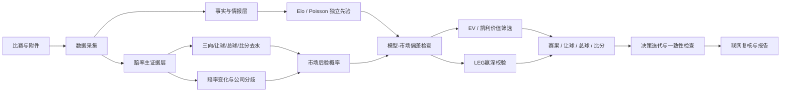

<div align="center">

# Football Analyst v2

### 赔率主导、模型互验的足球赛前分析系统

以中国竞彩市场为入口，优先解读赔率结构、盘口深度、大小球、比分指数和赔率变化，再用 Elo、Poisson、EV/凯利和 LEG 深度模型交叉验证，输出赛果、让球、总进球和比分概率。

[](https://www.python.org/)
[](LICENSE)
[](https://github.com/tszming1021/football-analystv2/actions/workflows/ci.yml)
[](https://github.com/tszming1021/football-analystv2)

**赔率主证据 · Elo/Poisson先验 · EV/凯利价值 · LEG深度验证 · 赛后校准**

[快速开始](#快速开始) · [分析架构](#分析架构) · [模型体系](#模型体系) · [项目文档](#项目文档)

</div>

---

## 项目定位

Football Analyst v2 是一套面向中国竞彩、世界杯及主要足球赛事的赛前研究工作流。当前版本的判断顺序是：

1. 先读取并去水赔率数据，判断市场真实倾向。
2. 再用 Elo/Poisson 生成独立概率先验。
3. 用 EV/凯利检查赔率是否存在正期望。
4. 用 LEG 判断热门方只是胜面高，还是具备赢深条件。
5. 最终结论必须解释市场与模型一致、分歧或互相否决的原因。

系统不依赖单一模型直接下结论，而是分别回答四个问题：

| 分析层 | 核心问题 | 主要输出 |
|---|---|---|
| 赛果 | 双方在常规时间内谁更可能取胜 | 胜、平、负概率 |
| 让球 | 热门方的优势是否足以覆盖当前让球 | 让胜、让平、让负概率 |
| 总球 | 比赛节奏与进球期望落在哪个区间 | 0 至 7+ 球概率 |
| 比分 | 哪些比分是主线，哪些是风险尾部 | Top 3、上沿与冷门比分 |

> 核心原则：赔率数据是主证据，Elo/Poisson 是独立先验，EV/凯利看价值，LEG 看深度。强队胜面高，不等于具备赢深条件。

## 核心能力

| 模块 | 能力 |
|---|---|
| 市场数据 | 500竞彩主表、欧赔、亚盘、大小盘、让球指数、比分指数、赔率变化和公司分歧 |
| 基本面 | 排名、近期状态、主客拆分、交锋、赛程、首发、伤停与战意 |
| 外部补源 | API-Football、Open-Meteo、Polymarket、OddsPortal及其他可选数据源 |
| 临场补源 | Flashscore首发/阵型/事件/技术统计，AiScore即时比分/射门/危险进攻/角球/部分赔率 |
| 数学模型 | Elo、Poisson、Dixon-Coles、EV、凯利与贝叶斯融合 |
| 深度判断 | LEG让球深度、赔率总球、比分矩阵约束与一致性检查 |
| 风险控制 | 数据完整度、偏差保护、串关相关性、赛前防泄漏与降级机制 |
| 复核闭环 | GPT联网事实核验、结构化报告、Brier Score、Log Loss与错误归因 |

## 分析架构


```mermaid
flowchart LR
    A["比赛与附件"] --> B["数据采集"]
    B --> C["赔率主证据层"]
    B --> D["事实与情报层"]
    C --> E["三向/让球/总球/比分去水"]
    C --> F["赔率变化与公司分歧"]
    D --> G["Elo / Poisson 独立先验"]
    E --> H["市场后验概率"]
    F --> H
    G --> I["模型-市场偏差检查"]
    H --> I
    I --> J["EV / 凯利价值筛选"]
    I --> K["LEG赢深校验"]
    J --> L["赛果 / 让球 / 总球 / 比分"]
    K --> L
    L --> M["决策迭代与一致性检查"]
    M --> N["联网复核与报告"]
```

每次正式分析都保留数据截点、来源质量、有效权重、触发规则以及调整前后概率，便于复查而不是只保留最终结论。

## 模型体系

### 多源赛果融合

严格赛果模型以 500、欧赔、亚盘、大小球、比分盘和赔率变化为主证据，再用 Elo/Poisson 独立先验、EV/凯利和 LEG 深度互相验证，避免单一模型直接下结论。分析时优先回答三件事：

- 赔率是否已经给出清晰方向，还是存在分歧和诱导风险。
- Elo/Poisson 独立先验是否支持市场方向。
- 当前赔率下是否仍有 EV/凯利价值，还是只是热门但无价值。

基础权重会根据以下因素动态折扣并重新归一化：

- 数据新鲜度与样本完整度。
- 市场流动性、价差和成交质量。
- 不同市场之间的相关性，防止重复计票。
- 模型与市场的偏差幅度。
- 阵容、赛事阶段和比赛语境的可确认程度。

### 独立玩法模型

| 玩法 | 主要依据 |
|---|---|
| 赛果 | 三向赔率去水、赔率变化、Elo/Poisson先验与市场分歧 |
| 让球 | 让球三向去水、亚盘深度、LEG深度与净胜球矩阵 |
| 总球 | 总进球赔率、大小盘盘口、泊松λ、天气和节奏 |
| 比分 | 比分赔率、Dixon-Coles矩阵、赛果后验和总球约束 |

### xG说明

当前版本已经移除 xG/proxy xG 计算层，不再把普通进失球包装成 xG。预期进球由 Elo/历史进失球、赔率总球、三向去水概率和比分盘共同反推泊松 λ，并在报告中标注来源。

GPT 联网复核和奇门辅助的直接概率权重均为 **0%**。它们用于核验事实、发现冲突和触发重算，不能直接覆盖数学模型。

完整权重、公式和动态折扣规则见 [PROJECT_INTRODUCTION.md](PROJECT_INTRODUCTION.md)。强制分析约束见 [PROJECT_IRON_RULES.md](PROJECT_IRON_RULES.md)。

## 快速开始

### 1. 获取项目

```bash
git clone git@github.com:tszming1021/football-analystv2.git
cd football-analystv2
```

### 2. 创建环境

```bash
python3 -m venv .venv
source .venv/bin/activate
python3 -m pip install -e .
cp .env.example .env
```

在 `.env` 中填写所需数据源密钥。所有数据源均为可选，但数据缺失会降低报告完整度和推荐等级。

### 3. 运行分析

单场分析：

```bash
python3 new_main.py --match "荷兰 vs 瑞典"
```

多场分析：

```bash
python3 new_main.py \
  --matches "荷兰 vs 瑞典,德国 vs 科特迪瓦,突尼斯 vs 日本"
```

安装后也可使用命令行入口：

```bash
football-analyst --match "荷兰 vs 瑞典"
football-review summary
football-worldcup Argentina France --season 2026
```

## 世界杯离线模型

历史比赛只在训练阶段读取，运行时加载紧凑 JSON 产物，降低上下文和磁盘开销。

```bash
python3 train_worldcup_model.py \
  --data-dir /path/to/football-historical-data \
  --output data/trained/worldcup_model.json \
  --cutoff-date 2026-06-01
```

训练产物包含国家队 Elo、攻防强度、近期表现、赛事权重、射手集中度和点球大战倾向。`--cutoff-date` 用于阻止目标日期之后的数据进入训练样本。

## 报告输出

标准报告包含：

- 数据来源、时间截点和完整度审计。
- 赔率主证据、市场方向、公司分歧与赔率变化。
- Elo/Poisson独立先验与市场偏差。
- EV/凯利价值筛选和偏差保护。
- 让球三向概率、LEG深度与卡线风险。
- 精确总进球分布和大小球判断。
- 比分 Top 3、强队上沿路径和冷门保护。
- 数据冲突、阵容风险、天气影响与串关限制。
- GPT联网复核结论及需要重新计算的事实变化。

报告模板位于 [report_template_jingcai_multi_match.md](report_template_jingcai_multi_match.md)、[report_template_jingcai_qimen.md](report_template_jingcai_qimen.md) 和 [report_template_standard.md](report_template_standard.md)。多场竞彩报告优先使用 `report_template_jingcai_multi_match.md`。

## 项目结构

```text
football-analystv2/
├── core/                         # 采集、模型、融合、决策与报告核心
│   └── data_sources/            # 外部数据源适配器
├── data/
│   └── calibration/             # 稳定权重策略与决策迭代规则
├── scripts/                      # 日期批次采集、分析与报告脚本
├── tests/                        # 单元测试
├── new_main.py                   # 主分析入口
├── review_cli.py                 # 赛后复盘入口
├── worldcup_predictor.py         # 世界杯预测入口
├── train_worldcup_model.py       # 离线模型训练入口
├── PROJECT_IRON_RULES.md         # 不可绕过的分析铁律
└── PROJECT_INTRODUCTION.md       # 完整流程、权重与治理说明
```

更细的模块说明见 [PROJECT_STRUCTURE.md](PROJECT_STRUCTURE.md)。

## 数据与安全

仓库默认排除以下本地内容：

- `.env` 与所有真实 API 密钥。
- PDF、XLS/XLSX、CSV及其他原始附件。
- SQLite、赔率快照、比赛批次数据与训练产物。
- 生成报告、音视频、缓存和本地上下文快照。

公开仓库只保留核心代码、模板、稳定策略和可复现说明。安全报告方式见 [SECURITY.md](SECURITY.md)。

## 测试

```bash
python3 -m compileall -q core new_main.py review_cli.py worldcup_predictor.py
python3 -m unittest discover -s tests -v
```

GitHub Actions 会在 Python 3.9 和 3.12 上执行相同检查。

## 项目文档

| 文档 | 内容 |
|---|---|
| [PROJECT_INTRODUCTION.md](PROJECT_INTRODUCTION.md) | 完整分析流程、分层权重和优化路线 |
| [PROJECT_IRON_RULES.md](PROJECT_IRON_RULES.md) | 正式分析必须遵守的铁律 |
| [PROJECT_STRUCTURE.md](PROJECT_STRUCTURE.md) | 文件结构、模块职责和本地数据说明 |
| [CONTRIBUTING.md](CONTRIBUTING.md) | 开发、测试和提交约定 |
| [SECURITY.md](SECURITY.md) | 密钥管理与安全问题报告 |

## 免责声明

本项目仅用于数据研究、概率建模和赛后复盘，不构成投注建议，也不保证任何预测结果。使用者应自行判断风险，并遵守所在地法律法规。

---

<div align="center">

**让每个结论都能追溯到数据、权重和规则。**

</div>
